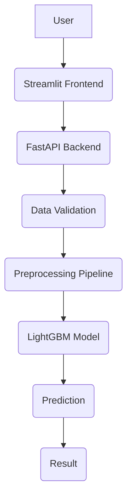

# 🏦 Credit Risk Assessment System

> **An end-to-end Machine Learning application that predicts loan default risk using customer demographics, financial information, credit bureau history, and previous loan records. Built with LightGBM, optimized using Optuna, explained with SHAP, and deployed using FastAPI and Streamlit.**

<p align="center">


</p>

---

# 📌 Table of Contents

- Overview
- Business Problem
- Features
- Tech Stack
- Dataset
- Workflow
- Architecture
- Repository Structure
- Machine Learning Pipeline
- Feature Engineering
- Model Development
- Performance
- Explainability
- API
- Installation
- Usage
- Future Improvements
- Author

---

# 📖 Overview

Financial institutions receive thousands of loan applications every day. Approving high-risk applicants increases financial losses, while rejecting reliable applicants reduces business opportunities.

This project implements a **production-style Credit Risk Assessment System** that predicts whether an applicant is likely to default on a loan using demographic, financial, bureau, and previous application data.

The repository demonstrates an end-to-end workflow from data preprocessing and feature engineering to model deployment using FastAPI and Streamlit.

---

# 💼 Business Problem

The objective is to predict loan default before approval so lenders can:

- Reduce financial losses
- Improve underwriting decisions
- Identify risky applicants
- Support data-driven lending
- Improve portfolio quality

---

# ✨ Features

- End-to-End ML Pipeline
- Exploratory Data Analysis
- Data Cleaning
- Feature Engineering
- Multi-source Dataset Merging
- LightGBM Credit Risk Prediction
- Optuna Hyperparameter Optimization
- SHAP Explainability
- FastAPI REST API
- Interactive Streamlit UI
- Modular Codebase

---

# 🛠 Tech Stack

| Category | Technologies |
|-----------|--------------|
| Language | Python |
| Data Analysis | Pandas, NumPy |
| Visualization | Matplotlib |
| ML | Scikit-Learn, LightGBM |
| Hyperparameter Tuning | Optuna |
| Explainability | SHAP |
| API | FastAPI |
| Frontend | Streamlit |
| Serialization | Pickle |
| Version Control | Git & GitHub |

---

# 📊 Dataset

**Dataset:** Home Credit Default Risk (Kaggle) - [Dataset 🔗](https://www.kaggle.com/competitions/home-credit-default-risk)

Sources used:

- Application Data
- Bureau Credit History
- Previous Home Credit Applications

---

# 🔄 Workflow

```text
Raw Data
   ↓
Data Understanding
   ↓
EDA
   ↓
Data Cleaning
   ↓
Feature Engineering
   ↓
Dataset Merging
   ↓
Preprocessing
   ↓
Model Training
   ↓
Optuna Optimization
   ↓
Model Evaluation
   ↓
SHAP Explainability
   ↓
FastAPI
   ↓
Streamlit
```

---

# 🏗 Architecture



---

# 📂 Repository Structure

```text
Credit-Risk-Assessment-System
│
├── api/                # FastAPI backend
├── frontend/           # Streamlit frontend
├── Models/             # Trained model & preprocessor
├── Data/
│   ├── raw/
│   ├── cleaned/
│   ├── featured/
│   └── merged/
├── notebooks/          # EDA, preprocessing, training
├── schema/             # Pydantic schemas
├── utils/              # Utility modules
├── requirements.txt
└── .gitignore
```

---

# ⚙ Machine Learning Pipeline

- Data Understanding
- Exploratory Data Analysis
- Missing Value Handling
- Outlier Treatment
- Feature Engineering
- Aggregation
- Encoding
- Preprocessing Pipeline
- Model Training
- Hyperparameter Optimization (Optuna)
- Model Evaluation
- SHAP Explainability
- Deployment

---

# 🧠 Feature Engineering

Engineered features include:

- Credit Utilization Ratio
- Debt Ratio
- Credit-Annuity Ratio
- Goods-Credit Ratio
- Annuity-Income Ratio
- Previous Loan Approval Rate
- Credit Age Statistics
- Total Outstanding Debt
- Total Credit Limit
- Number of Active Loans
- Employment Features
- Organization Grouping

---

# 🤖 Model Development

Models compared:

| Model | ROC-AUC |
|--------|--------:|
| Random Forest | 0.698 |
| XGBoost | 0.721 |
| CatBoost | 0.733 |
| **LightGBM (Selected)** | **0.7405** |

LightGBM was selected after Optuna hyperparameter optimization.

---

# 📈 Performance

| Metric | Score |
|--------|------:|
| ROC-AUC | **0.7405** |
| Accuracy | 0.70 |
| Precision | 0.16 |
| Recall | **0.66** |
| F1-score | 0.26 |

> **Note:** Because the dataset is imbalanced, ROC-AUC and Recall were prioritized over Accuracy.

### Class Imbalance

Two approaches were evaluated:

- Class Weights ✅ (Selected)
- SMOTE

Class weights achieved better minority-class recall than SMOTE.

---

# 🔍 SHAP Explainability

SHAP was used to:

- Explain individual predictions
- Measure feature importance
- Increase model transparency
- Improve trust in predictions

---

# 🚀 API

**Endpoint**

```http
POST /predict
```

Returns:

- Prediction
- Default Probability
- Confidence Score
- Risk Category

---

# ⚡ Installation

```bash
git clone https://github.com/<your-username>/Credit-Risk-Assessment-System.git

cd Credit-Risk-Assessment-System

pip install -r requirements.txt
```

---

# ▶ Usage

### Start Backend

```bash
uvicorn api.main:app --reload
```

### Start Frontend

```bash
streamlit run frontend/app.py
```

Open:

```text
http://localhost:8501
```

---

# 🌟 Why This Project?

- Production-style project structure
- Modular preprocessing pipeline
- Explainable AI with SHAP
- Hyperparameter optimization using Optuna
- REST API integration
- Interactive Streamlit interface
- Real-world financial use case

---

# 🔮 Future Improvements

- Docker Support
- Multiple Model Selection
- Enhanced UI/UX
- Cloud Deployment
- CI/CD Pipeline
- Model Monitoring
- Batch Predictions
- MLflow Integration
- Automated Retraining
- User Authentication

---

# 🤝 Contributing

Contributions, suggestions, and feature requests are welcome.

1. Fork the repository
2. Create a feature branch
3. Commit your changes
4. Open a Pull Request

---

# 📄 License

MIT License

---

# 👨‍💻 Author

**Meet Gajera**

Data Science & Machine Learning Enthusiast

---

⭐ **If you found this project useful, consider giving it a star!**
